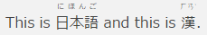

# Grav Shortcode Ruby Plugin

## About

The **Shortcode Ruby** plugin provides the `[ruby]` shortcode for
[Grav](https://github.com/getgrav/grav) to add ruby annotations using the `<ruby>` tag.  It needs
and the  [Shortcode Core](https://github.com/getgrav/grav-plugin-shortcode-core) plugin to work.

The plugin is spun of the [Markdown RubyText](https://github.com/tidiview/grav-plugin-markdown) plugin, see [here](https://github.com/tidiview/grav-plugin-markdown-rubytext/pull/2).

## Installation

Typically a plugin should be installed via [GPM](http://learn.getgrav.org/advanced/grav-gpm) (Grav Package Manager):

```
$ bin/gpm install shortcode-ruby
```

Alternatively it can be installed via the [Admin Plugin](http://learn.getgrav.org/admin-panel/plugins)

## Usage

Using the shortcode like

```
This is [ruby=にほんご]日本語[/ruby] and this is [ruby=ㄏㄢˋ]漢[/ruby].
```

will produce the following HTML:

```
this is <ruby><rb>日本語</rb><rp>（</rp><rt>にほんご</rt><rp>）</rp></ruby> and this is <ruby><rb>漢</rb><rp>（</rp><rt>ㄏㄢˋ</rt><rp>）</rp></ruby>.
```

Standart display:


